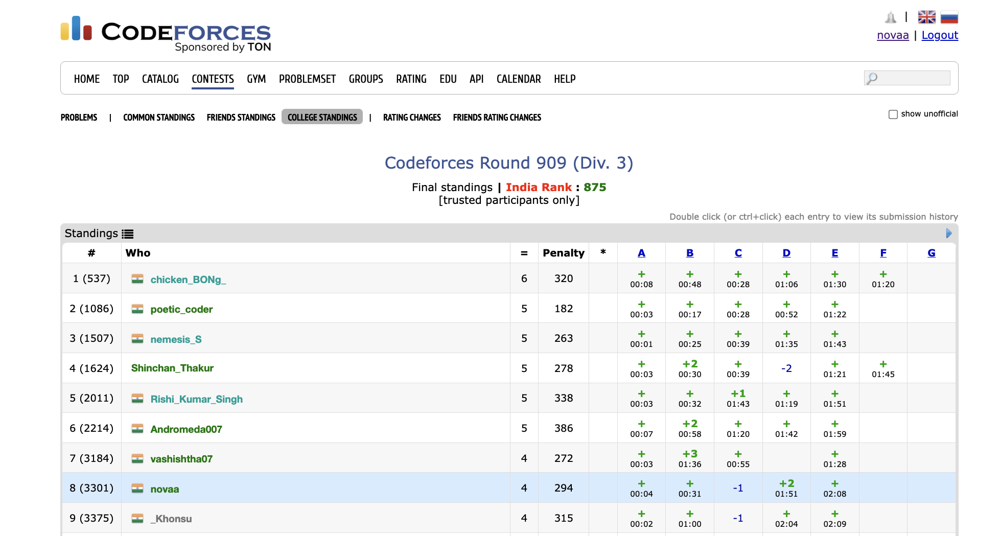

# CF College Standings

## Overview

The **CF College Standings** Chrome extension enhances your Codeforces experience by allowing you to view standings specifically for your organization. After installing this extension, you will find a new button titled **"College Standings"** on the standings page, which directs you to a customized standings page for your organization's members.

## Features

- **Automatic Organization List Creation**: Fetches and creates a list of all users from your organization with the name `organization-${id}`. You can view this list in the "Lists" section of Codeforces ([Codeforces Lists](https://codeforces.com/lists)).
- **Standings Button**: Adds a **"College Standings"** button to the standings page, located to the right of the friends' standings button.
- **Automatic Data Fetch**: Updates the list of users from your organization every 24 hours.
- **Manual Refresh**: Allows you to manually refresh the organization list by clicking the "Refetch Organization List" button in the extension popup.
- **Country Rank Feature**: Displays your country rank on the contest page. This feature will only be active after the ratings have been released. Note that you need to wait for 10-15 seconds for the first time you open any contest page to see your rank.

## Installation

1. Download and unzip the extension package.
2. Go to `chrome://extensions` in your Chrome browser.
3. Enable "Developer mode" by toggling the switch in the top right corner.
4. Click on "Load unpacked" and select the directory containing the extension files.

## Usage

1. Once installed, navigate to the Codeforces standings page.
2. You will see a new button **"College Standings"** next to the **"Friends Standings"** button. Click it to view the standings of users from your organization.
3. If the **"College Standings"** button is missing or you can't find your friend in the college standings, ensure:
   - Your profile includes your organization.
   - Your organization and your friend's organization should match exactly (check for duplicate entities & organization-id).
4. To view your country rank on the contest page, please wait for 10-15 seconds for the first time you open any contest page. The rank will be displayed once the ratings have been updated for that particular contest.

## Refetching Data

- The extension automatically updates the list every 24 hours.
- To manually re-fetch the organization list, click the extension icon and then click on the "Re-fetch Organization List" button in the popup.

## Feedback & Support

- **Feedback**: Please feel free to give me feedback on the extension.
- **Bugs & Issues**: Please comment on this repository if you encounter any errors or bugs.
